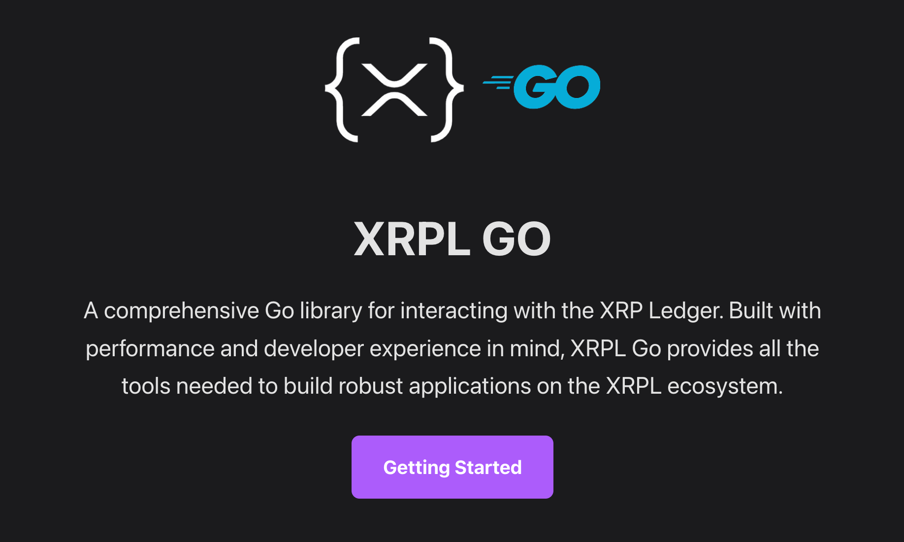
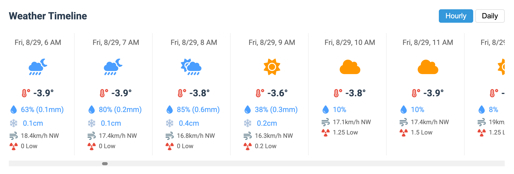
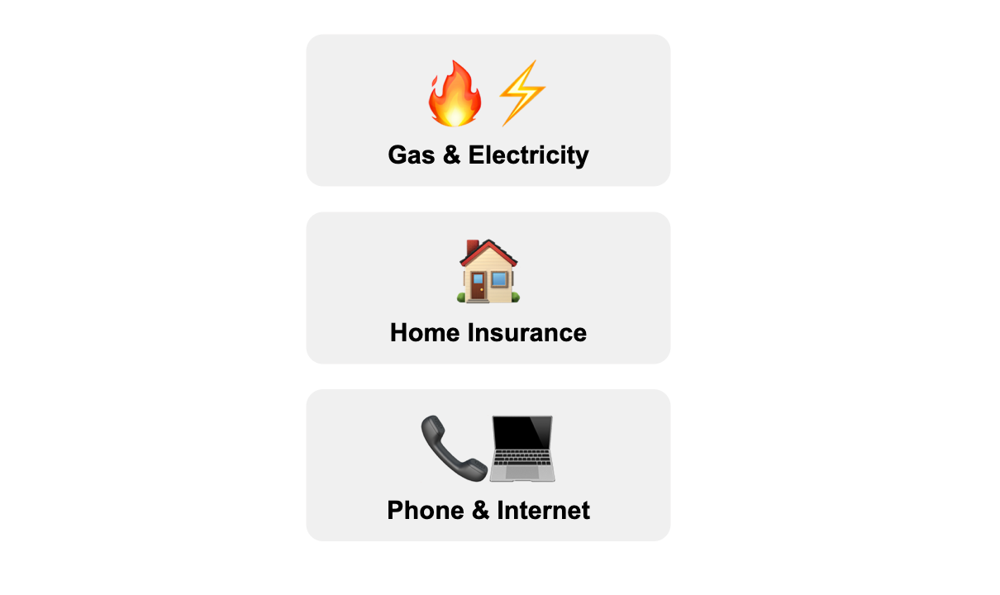
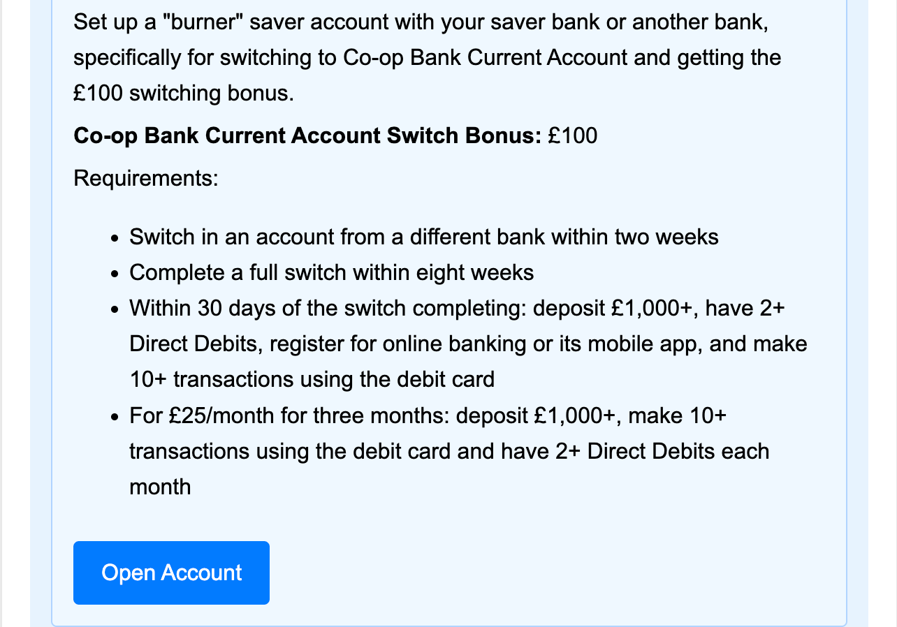
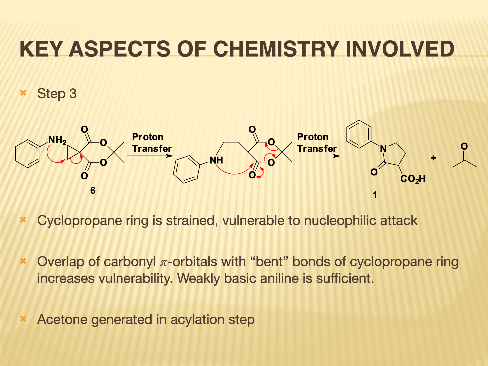

Hi, I’m Josh.

## About Me
I'm a developer from the UK, currently based in NZ/APAC. I've authored and worked on blockchain network libraries, SDKs, CLI tools, wallet clients, weather APIs and much more with Golang. My focus is on building robust systems that are easy to maintain and scale. I take a pragmatic test-driven approach, ensuring that I thoroughly understand the problems and don't overengineer the solutions.

I also work on SaaS products and web applications with modern web frameworks like React, Next.js, Tailwind CSS and more. Recently I've worked on a media sharing platform for events and various SaaS products. These have involved integrations with third-party services and APIs like Stripe, Supabase, OpenAI, n8n, Metabase, Openstreetmap and more. 

## Open Source

I'm a big fan of the open source ethos and have authored and contributed to multiple projects, most notably xrpl-go, a Go library for the Ripple (XRP) Ledger blockchain. The XRPL is a top 5 blockchain network in terms of market cap and is one of the oldest and most established networks. I worked on the binary codec which allows you to encode and decode binary data to and from the XRPL, the address codec which allows you to encode and decode addresses to human readable format, keypairs which handles generating and managing keypairs for accounts and signing transactions, jsonrpc client and websocket client which allows you to interact with the XRPL network and the test suite. The project is now owned by the XRPL Foundation.

I've also authored SDKs and CLI tools for open weather APIs.

## Personal Projects

I love solving real world problems and I'm always on the lookout for how to make things more efficient and identifying gaps in the market.

---
I created a weather forecasting app to better plan hiking and skiing in New Zealand because my friends and I complained so much about forecast accuracy - we all find it way more reliable and accurate than the weather apps we used before. 

---

I made a dashboard app for my grandmother to track all of her bills and payments on her iPad in a way that isn't overwhelming. 

---

I made a simple web app for my partner and I to keep track of bank savings rates and signing on bribes - it tells us where to put our money to get the best return for the next 12 months. We've earned thousands from the switch bribes alone! I'm always looking for ways to reduce friction and take advantage of automation to grab opportunities while they are available.

---

Note: For my personal projects, if I can achieve my goal with vanilla JS/HTML/CSS, I will use that every time as it's cheap to host, faster to develop, quicker time to first bite and more maintainable because there are less dependencies to manage.

## Career Progression

For a quick overview of my career, you can watch this video generated by [Golpo AI](https://video.golpoai.com/):

<video width="100%" style="max-width: 100%; display: block; margin: 0 auto;" controls>
  <source src="josh_golpo_small.webm" type="video/webm">
</video>

---
### Current Role (2021 - Present)

I'm currently a developer in a small team working on SDKs, CLI tools and SaaS products. I've successfully raised funding 3 times to work on open source projects, from proposal through to delivery. I've also worked on multiple SaaS products, from ideation through to launch and iteration. So my contributions span across the backend and frontend, adjusting my focus and skills as needed which is great because I enjoy challenges and being creative. All the work is done with a laser focus on the user and their experience.

### Previous Roles 

I took important lessons from each of my previous roles which have helped me through my career. For example having a strong end-user focus, communication skills and a solid understanding of business have proven invaluable.

#### Technical Applications Specialist (2019 - 2021)

My role initially was to support the sales team by providing technical information and conducting demonstrations of surgical devices in hospital theatres. This morphed into a more holistic role where I was also responsible for sales of capital equipment, consumable devices, and service contracts, as well as business development, customer relationship management, internal and external training, technical support, preventative maintenance, inventory management and much more.

It was fast paced and required strong problem-solving and communication skills under pressure because I had to troubleshoot and fix issues live during the surgical procedures. I also had to navigate complex sales processes and negotiate contracts with hospitals and healthcare professionals, which involved presenting detailed technical product information and benefits to stakeholders.

---

#### Technical Sales Specialist and Product Owner (2016 - 2019)

In this role, I was responsible for introducing an innovative new product to the market and developing a sales pipeline for it. This required me to conduct technical demonstrations, presentations and training to prospective clients and our sales team. I also worked closely with prospects to understand their needs and translate them into technical requirements for the product - which also informed how to position the product in the market.

My other responsibilites included sales, business development, CRM, live technical support and more.

Aside from product ownership and sales, I organised and delivered a Royal College accredited surgical skills course for trainee surgeons in the UK.

---

#### Laboratory Technician (2015-2016)

I was responsible for conducting experiments and analysing the results to support the research, quality assurance and process optimisation teams.

I developed and implemented new testing methods that were vital for acceptance testing of a new production line. This also required me to lead a cross-functional team from the manufacturing, R&D and QA departments.

---
## Education

My education includes a BSc in Chemistry from a UK Russell Group university. I've always been interested in science and technology and this degree gave me a solid foundation in technical communication and approaches to problem solving. In my final year I designed a 3 step method to produce an organic chemical with applications in cancer research and successfully synthesised the compound in the lab.

---
## Skills

| **Programming Languages & Core Technologies** | **DevOps & Infrastructure** | **AI & Development Assistance** |
|:---|:---|:---|
| golang (go) | docker | ai agents, copilot, coderabbit |
| javascript/typescript | aws | chatgpt, claude |
| html/css | ci/cd | local llms, hugging face |
| sql | github actions | prompt engineering |
| **Frontend Development** | makefile, bash, shell scripts | **Project Management & Collaboration** |
| react | **Development Tools & Workflow** | trello, jira, notion |
| next.js | git, github, gitlab | github projects |
| tailwindcss | vscode, cursor, windsurf | peer review, pull requests |
| **Backend & APIs** | postman | **Monitoring & Analytics** |
| node.js | figma, bolt | metabase |
| postgresql, sqlite, redis, mongodb | jest | n8n |
| openapi/swagger | **Testing & Quality** | error handling, debugging, triage |
| oauth | unit tests, integration tests, e2e tests | **Deployment & Hosting** |
| webhooks & websockets | benchmark tests | vercel, render, supabase |
| | pre-commit hooks, linting | ssh, remote dev containers |
| | test driven development (tdd) | **Operating Systems & Environments** |
| | | linux (ubuntu) |
| | | containers (docker, lxd, lxc, multipass) |
| | | windows, macos |
| | | microsoft 365 |

---
## Contact

If you'd like to get in touch with me, please feel free to send an email and I'll get back to you :)

[josh.go.work@gmail.com](mailto:josh.go.work@gmail.com)

© 2025 joshwalong

